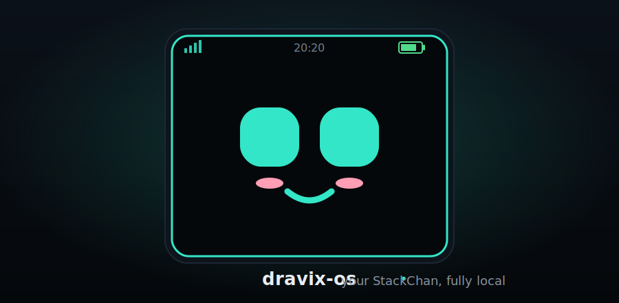
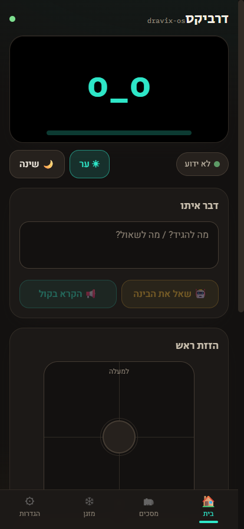
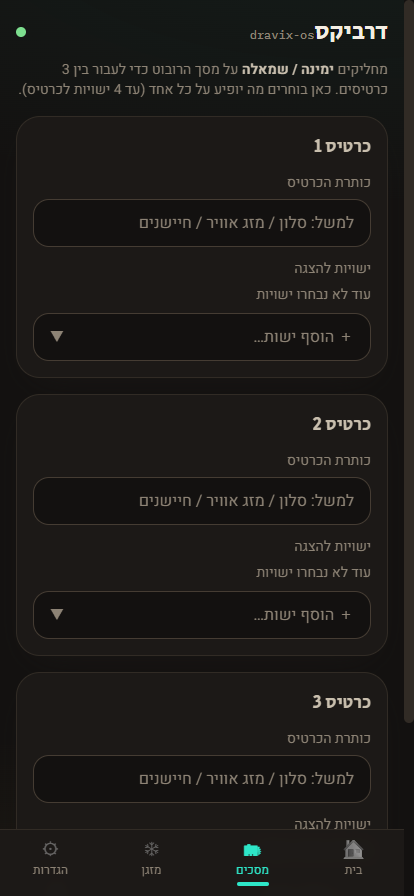
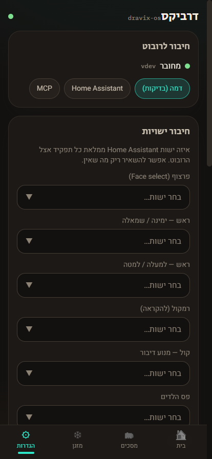

# dravix-os

<p align="center">
  
</p>

<p align="center">
  <b>A local-first companion layer for the M5Stack StackChan desk robot — delivered as a Home Assistant add-on.</b>
</p>

dravix-os turns the StackChan into a little desk creature you fully own. You re-flash the robot to
custom **dravix ESPHome firmware** — a drawn animated pet face, petting, voice, camera, LEDs, a
games arcade and a *real life* (needs it takes care of) — which exposes every part of the hardware
to Home Assistant as ordinary entities. The dravix add-on then drives it through those entities,
adding custom **modes**, a **mobile dashboard**, a persistent **personality**, a pluggable **AI
brain**, and deep **smart-home** integration. Everything runs on your own hardware; nothing phones
home.

```
┌──────────────────────────────┐   ESPHome   ┌──────────────────────────────────────────────┐
│  StackChan · M5 CoreS3        │   native    │       Home Assistant  (your always-on host)   │
│  ── custom dravix ESPHome ──  │   API       │  ┌────────────────┐   ┌────────────────────┐  │
│  drawn pet face · head servos │◄───────────►│  │    HA core     │◄─►│  dravix-os add-on  │  │
│  mic · speaker · touch        │             │  │  entities +    │   │  dashboard · modes │  │
│  camera · LEDs · battery      │             │  │  Assist        │   │  personality · AI  │  │
└──────────────────────────────┘             │  └────────────────┘   │  MCP server        │  │
            the body                          │                       └────────────────────┘  │
                                              └──────────────────────────────────────────────┘
                                                        the brain + control panel
```

The robot joins Home Assistant over the ESPHome native API; the dravix add-on runs inside HA and
talks to HA core over REST/WebSocket. There is no cloud in the loop.

## 🧭 Core principles

1. **Local-first.** dravix-os runs fully on your box. `local_only` (default on) refuses cloud AI
   providers, and nothing talks to a vendor cloud. See [docs/local-only.md](docs/local-only.md).
2. **Everything is pluggable.** Robot drivers, AI providers and modes are swappable behind clean
   interfaces (the [Device Abstraction Layer](docs/architecture.md)). Higher layers only ever see
   the `RobotController` facade, so *how* the robot is reached can change without touching modes,
   AI or the dashboard.
3. **Capability-guarded.** Modes check `robot.supports(...)` before acting, so behaviour degrades
   gracefully across backends.

## 🚀 Getting started

**You'll need:** an M5Stack **StackChan (CoreS3)**, a running **Home Assistant** with the official
**ESPHome** add-on installed, and a **USB-C** cable.

1. **Install the add-on.** In Home Assistant → **Settings → Add-ons → Add-on Store → ⋮ →
   Repositories**, add `https://github.com/YossiKon/dravix-os`, then install **dravix-os**. HA
   pulls a prebuilt image from GHCR — nothing compiles on your box.

2. 🛡️ **Back up the robot's original firmware — do this before flashing anything.** It makes a
   byte-for-byte snapshot of the robot exactly as it is today that you can always restore. Follow
   **Step 0 — Back up the original firmware** in
   [docs/esphome-local-control.md](docs/esphome-local-control.md).

3. **Flash the dravix ESPHome firmware.** In the ESPHome Builder, **Validate** then flash
   [`deploy/esphome/stackchan-dravix.yaml`](deploy/esphome/stackchan-dravix.yaml). The robot joins
   Wi-Fi and appears in HA as a device with entities (face, head servos, media player, LEDs,
   camera, touch, vitals). Full walkthrough — flashing, first-boot tuning, entity ids —
   [docs/esphome-local-control.md](docs/esphome-local-control.md).

4. **Point dravix at the entities.** Open the add-on → **Configuration**. Leave `robot_driver: ha`
   and fill in the entity ids HA created — `robot_entity_face`, `robot_entity_head_yaw`,
   `robot_entity_head_pitch`, `robot_entity_media_player`, `robot_entity_light`,
   `robot_entity_camera` — plus your HA connection details. **Save → Restart.**

5. **Open the dashboard.** Click **Open Web UI** on the add-on page (or browse to
   `http://<home-assistant>:8800`). Map the **Live state** (`sensor.*_state`) and **Mode**
   (`select.*_mode`) entities, calibrate the head per-axis, and you're live.

> **Tip:** mapping the **Live state** + **Mode** entities is what lets the life system stay silent
> in focus/sleep and put the robot to sleep on its own — don't skip it.

Reversible at any time: re-flash your backup (or the stock firmware via M5Burner) and the robot is
back to how it was.

> No robot yet? You can still run and explore everything against the built-in **mock** driver —
> see the **Development** section below.

## 🤖 What the robot does (custom firmware)

Re-flashing to the dravix ESPHome firmware makes the StackChan act alive while staying fully
controllable from Home Assistant:

- **A drawn animated pet face** — two big eyes that blink, look around, squint when happy and widen
  when listening, pink cheeks and an animated mouth (a desk creature, not a text face). Every
  expression carries its own mood-LED colour and head pose — sad droops, doubt tilts, angry shakes,
  happy nods.
- **Petting** — touch the head and the sensors fire → pink LEDs, a nuzzle-up and a happy wiggle.
  This also feeds dravix's mood and its **fun/calm** needs.
- **7 on-device modes** — `awake · morning · focus · quiet · night · busy · sleep`, each changing
  the face, LEDs, volume and autonomous behaviour (set from HA or the dashboard). `morning` plays a
  little sunrise scene; `quiet` lowers the speaker; `night` dims everything.
- **Voice** — an on-device wake word, **"Okay, Nabu"**, hands off to HA Assist for STT/LLM/TTS; the
  face follows along (listening → speaking) and the live state, last-heard and last-reply text
  stream to the dashboard.
- **Speech bubble** — a bubble by the mouth shows what it's hearing and the AI's reply (Hebrew or
  English), with clear *listening* / *speaking* states.
- **A games arcade** — a **Games** menu on the robot's screen: **Catch Me** (tap the runaway dot),
  **Reaction** (a reflex speed test in milliseconds), **Simon** (the growing colour-sequence memory
  game), **Rock-Paper-Scissors** (it nods when it wins) and **Dice**.
- **A swipe UI** — swipe **down** for a slim status-bar overlay (Wi-Fi · battery · clock · date),
  and **left/right** through 3 **dynamic cards** (you choose the HA entities on each, from the
  dashboard), the **Games** arcade and the **Vitals** page — plus a full-screen alert-image page for
  Frigate / doorbell snapshots.
- **Privacy mode** — kills the microphone on-device (wake word + voice pipeline stopped) and shows a
  red **PRIVACY** badge; dravix additionally blocks the camera stream/snapshot.
- **Head calibration** — the head servos are driven and calibrated per-axis from the dashboard.
- **Battery** — level plus estimated time-left, shown on the status bar.

## 💗 A robot with a life

dravix gives the StackChan real **needs**, like a little Tamagotchi — **⚡ energy · 🍎 food ·
😄 fun · 🧘 calm**, each 0–100, shown as live bars both on the robot's own **VITALS** screen and on
the dashboard. They drift down over time and you top them up — **feed · rest · play · calm** — with
real feedback (it "eats", yawns, wiggles, LEDs). Petting and talking to it feed the needs too.

- **It looks after itself.** When a need bottoms out, the robot acts on its own — goes to sleep
  until it's rested and wakes back up, feeds itself, cheers itself up.
- **Wellness nudges for you.** While you work next to it, the robot reminds *you* to take care of
  yourself — eye breaks (the **20-20-20** rule), stand up and move (~every 30 min), hydrate,
  posture — appearing on its screen with a little wiggle so you notice. Toggle them from the
  dashboard.
- **A hard do-not-disturb rule.** In `focus`, `quiet`, `night`, `busy` and `sleep`, the life system
  and the nudges go **completely silent** — no autonomy, no reminders, nothing on-screen. Needs
  still tick down quietly in the background, but the robot does nothing on its own until it's back
  to `awake`.

## 📱 Web dashboard

The add-on ships a **Hebrew-first, RTL, mobile-friendly** dashboard: a live mirror of the robot's
face, chat with memory, mode switching, games & emotes, a head joystick, the privacy toggle, a
camera view, the dynamic-cards editor, the **Vitals** page (feed · rest · play · calm + the wellness
toggle), climate control, and entity mapping + per-axis head calibration.

|  Home  |  Screens  |  Settings  |
|:------:|:---------:|:----------:|
|  |  |  |
| Face, modes, chat, games | Choose each card's entities | Entity mapping & calibration |

## 🧩 Modes (plugins)

Beyond the on-device firmware modes above, dravix runs **plugin modes** — orchestration behaviours
that combine the robot, the AI router and Home Assistant. Foreground modes are mutually exclusive;
ambient modes run alongside them.

| Mode | Kind | What it does |
|------|------|--------------|
| `focus` | foreground | Calm work companion — quiet face, dim LEDs, gentle reactions while you work. |
| `pomodoro` | foreground | Work/break timer; announces phase changes and shows time on the face & LEDs. |
| `companion` | foreground | Chatty desk buddy; greets via the AI router and emotes from the reply's tone. |
| `guard` | foreground | Desk sentry; reacts to Home Assistant motion/presence/door events with an alert. |
| `dnd` | foreground | Do Not Disturb / meeting mode — calm "busy" face, dim LEDs, stays quiet. |
| `dance` | foreground | A little dance — bobs the head through a sequence and cycles the LED colours. |
| `frigate_watch` | foreground | On a Frigate detection, shows that camera on the robot's screen. |
| `follow` | foreground | Head tracks a person in real time from Frigate detections — off-device, no load on the robot. See [docs/frigate.md](docs/frigate.md). |
| `ambient_idle` | ambient | Subtle glances and blinks so the robot never looks frozen. |
| `daynight` | ambient | Sleepy face + warm dim LEDs at night, neutral by day. |

Add your own by dropping a `plugins/<name>/plugin.yaml` + a `Mode` subclass — full guide in
[docs/plugins.md](docs/plugins.md). Per-mode config, enable/disable and the AI provider are all
editable at runtime via the `/api/config/*` endpoints and persist across restarts (no redeploy).

## 🎭 Personality (the "desk robot" bit)

Inspired by EMO / Vector. A persistent **mood** (valence / arousal / affection) drifts over time,
reacts to being talked to, petted, motion and night, and shows on the robot's face. It survives
restarts. Plus a library of named **emotes** (happy, love, fistbump, curious, eat, yawn, calm, yes/
no…), a no-code **reactions** engine (event → action rules) and an **announce** endpoint. Full
guide: [docs/personality.md](docs/personality.md).

```bash
curl localhost:8800/api/vitals                                       # energy/food/fun/calm
curl -X POST localhost:8800/api/vitals/action -d '{"action":"feed"}' # feed it
curl -X POST localhost:8800/api/robot/interact -d '{"kind":"pet"}'   # pet it
curl -X POST localhost:8800/api/robot/emote    -d '{"name":"fistbump"}'
curl -X POST localhost:8800/api/timer -d '{"seconds":300,"label":"tea"}'   # timers + daily schedule
```

## 🧠 Switch the AI brain

The AI router is pluggable. The default provider is **Home Assistant Assist** (your host already
runs STT/LLM/TTS). Set the add-on's `ai_provider` (or `DRAVIX_AI_PROVIDER`) to switch —
`ha_assist | claude | openai | ollama` — with the matching `DRAVIX_*_MODEL` (see `.env.example`).
Replies may start with an emotion tag like `(happy)`, which dravix parses to drive the face
automatically.

## 🔌 Drive it from an AI agent (MCP server)

dravix-os exposes its **own** MCP server, so any MCP client (Claude Desktop / Code, etc.) can drive
the robot, modes and your home through one surface:

```bash
cd core && python -m dravix.mcpserver      # stdio MCP server
```

Tools include robot control (`robot_say`, `robot_set_face`, `robot_move_head`, `robot_set_leds`),
mode control (`list_modes`, `activate_mode`, `deactivate_mode`, `get_status`), AI `chat`, and a full
Home Assistant control suite (entities, services, scenes, lights, climate, media, locks, covers,
fans, alarm, vacuum) plus weather / agenda / memory helpers.

## 📷 Cameras & Frigate

dravix-os integrates with **Frigate** both ways, all on your LAN:

- **Show a Frigate camera on the robot's screen** — on a person/motion/door detection, the robot
  displays that camera and looks alert (the `frigate_watch` mode).
- **Feed the robot's own camera into Frigate** — dravix re-serves it as a standard HTTP camera that
  Frigate can run detection on.
- **Follow mode** — with the robot's camera tracked in Frigate, the `follow` mode makes the head
  track a person in real time, entirely off-device.

See [docs/frigate.md](docs/frigate.md). For copy-paste Home Assistant `rest_command`s and
automations, see [docs/home-assistant.md](docs/home-assistant.md).

## 🛠 Development

No robot or Home Assistant required — the **mock** driver logs calls instead of moving real
hardware, so you can develop the dashboard, modes and AI fully offline. It's the default driver.

```bash
cd core
python -m venv .venv && . .venv/bin/activate   # Windows: .venv\Scripts\activate
pip install -e ".[dev]"
python -m dravix                # runs on :8800 with the mock driver — no robot/HA needed
python -m pytest -q             # offline test suite
```

Configure the real driver + entities via `.env` (see `.env.example`) for local runs, or via the
add-on **Configuration** when deployed. The React dashboard lives in `web/` (`npm run dev`, proxies
the API to the Python core on :8800).

**Backup / restore** all your config (personas, routines, memories, schedule, reactions, voices):
`GET /api/export` downloads it, `POST /api/import` restores it.

## 🗂 Repository layout

| Path | What |
|------|------|
| `core/` | The dravix service (Python / FastAPI): DAL + drivers, mode engine, AI router, personality, vitals, MCP client + server, REST/WebSocket API |
| `plugins/` | Drop-in modes — each a `plugin.yaml` + a `Mode` subclass |
| `web/` | The React / Vite dashboard (Hebrew RTL), built into the add-on image |
| `deploy/esphome/stackchan-dravix.yaml` | The custom StackChan **ESPHome firmware** |
| `deploy/` | Dockerfile + packaging for the add-on image |
| `dravix_os/` | The Home Assistant **add-on** wrapper (`config.yaml`, `run.sh`) |
| `docs/` | Setup guides, architecture, ESPHome flashing, Frigate |
| `vendor/` | Upstream `m5stack/StackChan` — reference only, never patched |

See [docs/architecture.md](docs/architecture.md) for the layered design and Device Abstraction
Layer in detail.
